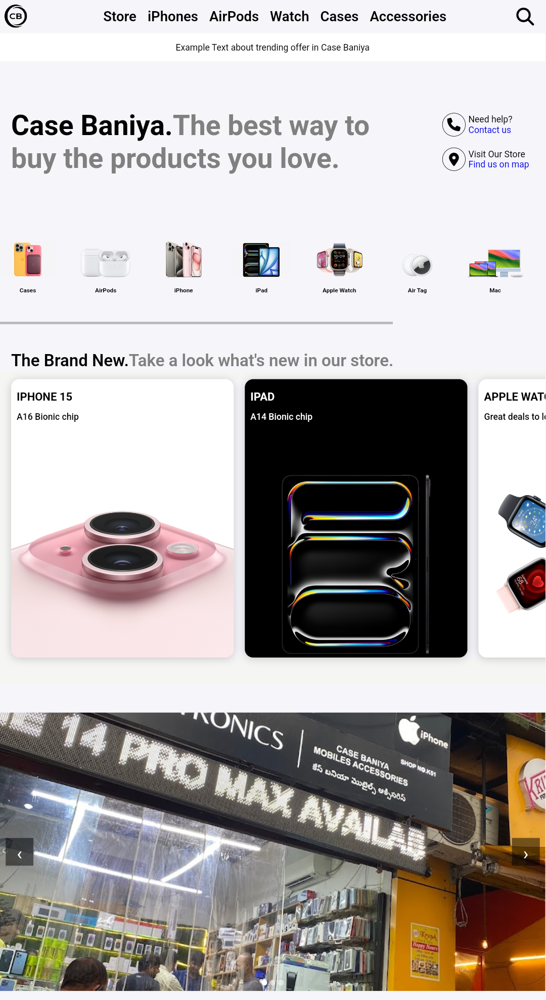
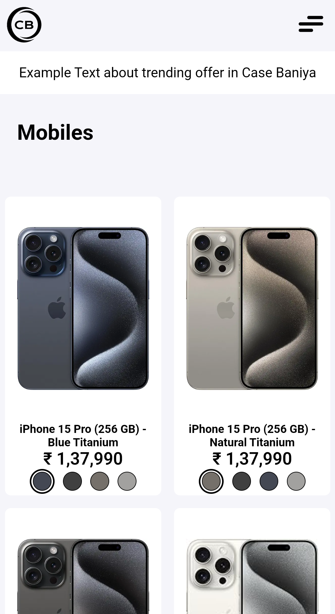

# Case Baniya

## Overview

Case Baniya is a website for a mobile and accessories store, showcasing responsive web development skills. The website features various sub-pages, including store, iPhones, watches, and more, providing a comprehensive online shopping experience.

## Features

- **Responsive Design:** The website is fully responsive and optimized for different devices and screen sizes.
- **Sub-pages:** Dedicated sections for various products such as iPhones, watches, and other accessories.
- **User-friendly Interface:** Clean and intuitive design for easy navigation.

## Technologies Used

- **HTML** - For structure and content
- **CSS** - For styling
- **JavaScript** - For functionality

## Screenshots

Here are some screenshots of the Case Baniya website:

### Home Page

### Store Page

### iPhones Page

### Watches Page

## Contact

For any questions or inquiries, please contact at [dev.ajmalkhan@gmail.com].
